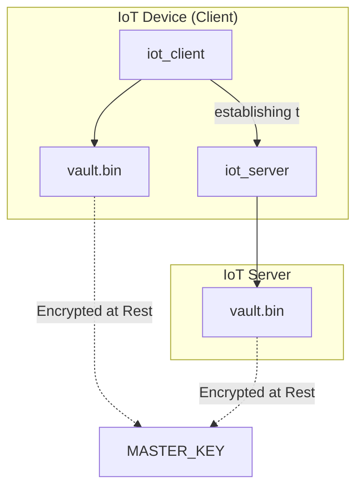

# IoT Secure Vault Authentication

Implementation of the authentication protocol from the research paper **"Authentication of IoT Device and IoT Server Using Secure Vaults"** (Shah & Venkatesan).

This project demonstrates a robust mutual authentication system for IoT devices, featuring dynamic session key establishment, forward secrecy via vault updates, and at-rest encryption for sensitive keys.

## 🚀 Key Features

*   **Mutual Authentication (3-Way Handshake)**: Both the IoT device and the server verify each other's identity using a shared secret "vault".
*   **Dynamic Session Key Establishment**: A unique 128-bit session key $t$ is established for every session.
*   **Encrypted Data Communication**: After authentication, the established session key $t$ is used to encrypt subsequent data exchanges.
*   **Forward Secrecy (Dynamic Vault Update)**: The secret vault is automatically updated after each successful handshake, ensuring that compromising a past vault does not lead to the compromise of future sessions.
*   **Encryption at Rest**: The vault files stored on disk are protected using AES-128-CBC encryption with a master key.
*   **Dockerized Environment**: Fully containerized for easy deployment and isolation.

---

## 🛠 Project Architecture



### Protocol Phases

1.  **Phase 1: Authentication (M1-M4 Handshake)**
    *   **M1**: Client initiates with Device ID.
    *   **M2**: Server sends Challenge $C_1$ and nonce $r_1$.
    *   **M3**: Client responds with $Enc(k_1, r_1 || t_1 || C_2 || r_2)$ where $k_1$ is derived from $C_1$.
    *   **M4**: Server responds with $Enc(k_2 \oplus t_1, r_2 || t_2)$.
    *   **Key**: Session key $t = t_1 \oplus t_2$ is established.

2.  **Phase 2: Secure Communication**
    *   An authenticated socket is maintained.
    *   The client sends data encrypted with $t$.
    *   The server decrypts and processes the data.

---

## 🚦 Getting Started

### Prerequisites

*   Docker & Docker Compose
*   Make (optional, for easy workflow commands)

### 1. Configure the Environment

Create a `.env` file in the root directory (or use the one provided):

```bash
MASTER_KEY=1234567890123456 # Must be at least 16 bytes
MY_UID=1000
MY_GID=1000
```

### 2. Generate the Secure Vaults

The system requires an initial shared secret vault. Use the provided tool to create and distribute it securely:

```bash
make generate-vault
```

### 3. Start the System

Bring up the persistent server and the client daemon:

```bash
make up
```

### 4. Trigger Authentication & Secure Messages

Since the client runs as a daemon, you trigger the authentication process by sending a signal:

```bash
make trigger-auth
```

### 5. Monitor Logs

Observe the mutual authentication, the session key establishment, and the subsequent encrypted message exchange:

```bash
docker compose logs -f
```

Example output:
```text
iot_server  | [SERVER] Authentification Mutuelle: SUCCÈS
iot_device  | [CLIENT] Tentative d'envoi de données sécurisées...
iot_server  | [SERVER] Données reçues (chiffrées par t): "Données sécurisées de IOT-DEVICE-001"
```

---

## 🧹 Maintenance

*   **Stop the system**: `make stop`
*   **Clean build artifacts and vaults**: `make clean`
*   **Run Unit/Integration tests**: `make test`

## 📚 Documentation

The source code is documented using Doxygen-style comments. You can generate a full HTML documentation by running:

```bash
# Generate HTML documentation
make doc
```

Once generated, open `docs/html/index.html` in your web browser.

## 📚 References

*   *Shah, J. and Venkatesan, S., "Authentication of IoT Device and IoT Server Using Secure Vaults", 2018.*
